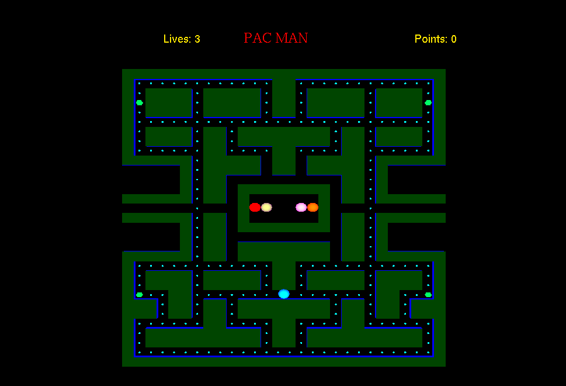
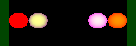

# OpenGL Game Environment


## Screenshot
The Maze

The Ghosts

The pac man


## Overview
This project is a basic game environment developed using OpenGL and FreeGLUT. It serves as a foundation for building interactive graphics applications.

## Environment Setup
The development environment was configured with the following tools and libraries:

- **Programming Language:** C++
- **Graphics Library:** OpenGL with FreeGLUT for rendering
- **Development Tools:** GCC Compiler and an IDE (e.g., Visual Studio or Code::Blocks)

### Initial Setup
The initial setup involved:
1. Linking the FreeGLUT library.
2. Creating a basic window to render the game environment.

## Features
- Basic window rendering.
- Integration with the FreeGLUT library.
- Setup for further graphics and game development.

## Prerequisites
Make sure the following tools and libraries are installed on your system:
- GCC Compiler
- FreeGLUT Library
- Visual Studio, Code::Blocks, or another C++ IDE

### Installation
1. Clone the repository:
   ```bash
   git clone https://github.com/username/OpenGL_Game_Environment.git
   cd OpenGL_Game_Environment
